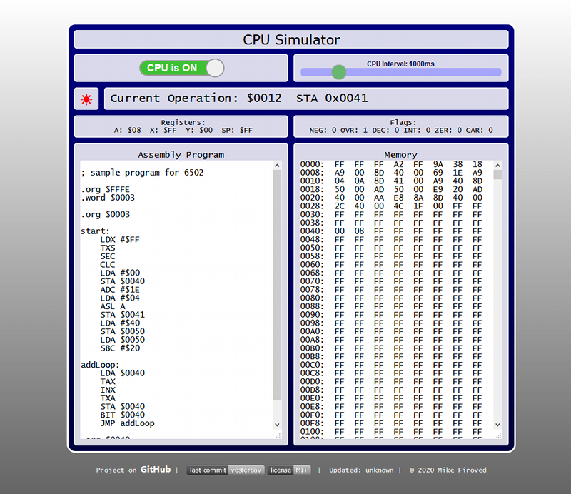
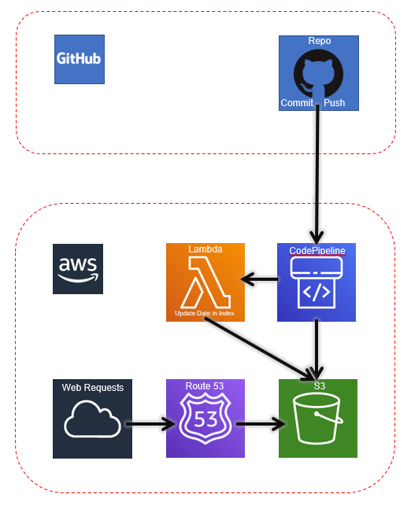

 


# Javascript CPU simulator
This is a JavaScript, HTML, CSS web page that simulates a 6502 CPU.

Back in January of 2015, because I was a huge fan of the 6502, I created a Visual Basic 6 implementation of a [6502 simulator](https://www.planet-source-code.com/vb/scripts/ShowCode.asp?txtCodeId=22670&lngWId=1). Since I really love JS, I thought about creating a HTML / CSS / JS project which simulates a 6502 CPU and see how far I could go with it.

The CPU that I am modeling this after is the maker community's beloved 8-bit CPU from 1980's, the 6502. Some famous 6502 based computers are the [Commodore VIC 20](https://en.wikipedia.org/wiki/Commodore_VIC-20), [Atari 2600](https://en.wikipedia.org/wiki/Atari_2600), and the [Apple IIe](https://en.wikipedia.org/wiki/Apple_IIe)

## Try it out
Try it out [here](http://firoved.com/github/javascript-cpu-simulator/)



## opcodes - assembly language commands
The opcodes used are based on the [6502 opcodes](http://www.6502.org/tutorials/6502opcodes.html).

### Currently the following opcodes work:

| Math | Load and Store | Transfer | Clear and Set | Logic | Stack   | Branch | Etc     | 
|:----:|:--------------:|:--------:|:-------------:|:-----:|:-------:|:------:|:-------:|
| ADC  | LDA            | TAX      | CLC           | AND   | PHA     | BCC    | NOP     |
| ASL  | LDX            | TAY      | CLD           | BIT   | PLA     | BCS    | ~~BRK~~ |
| DEX  | LDY            | TSX      | CLI           | CMP   | PHP     | BEQ    |         |
| DEY  | STA            | TXA      | CLV           | CPX   | PLP     | BMI    |         |
| INX  | STX            | TXS      | SEC           | CPY   | ~~RTI~~ | BNE    |         |
| INY  | STY            | TYA      | SED           | EOR   | RTS     | BPL    |         |
| LSR  |                |          | SEI           | ORA   |         | BVC    |         |
| ROL  |                |          |               |       |         | BCS    |         |
| ROR  |                |          |               |       |         | JMP    |         |
| SBC  |                |          |               |       |         | JSR    |         |


## Registers and Flags
The flags and registers are designed around the 6502 processor.

### Registers
 * A Register
 * X Register
 * Y Register
 * Stack Pointer (SP Register)


### Flags
| Negative | Overflow | Break H | Break L | Decimal | Interrupt | Zero | Carry |
|---|---|---|---|---|---|---|---|

The break flag is two bits.

## Assembler control commands
* .ORG - sets the origination point in memory of the next command or opcode
* .BTYE - adds a byte to memory
* .WORD - adds two bytes or a word to memory

## Todo

Working on wrapping my brain around how interupts work to properly simulate them. Compare commands are next.

The "To-Do" kanban board can be found [here](https://github.com/msfwebdude/javascript-cpu-simulator/projects/1).


## Automatic Deployments

I found it tedious, to open AWS, login with MFA, open S3, open the bucket, open the folder and upload files with settings for permissions, for every time I made a code change and commit.

So knowing I had the tools to simplify this process, I played around with AWS [CodePipeline](https://aws.amazon.com/codepipeline/) and created a pipeline to listen for commit webhook events from GitHub and automatically retrived the content, deployed it to my S3 bucket where I had my website pointed, and launched a lambda function to replace the `{DateUpdated}` token in `index.html` to the date that the page was updated and deployed. The page script in `cpu.js` takes this UTC ISO Date and converts it into the local user's local time:

```javascript
const dateUpdated = new Date(self.DateUpdated.innerHTML);

self.DateUpdated.innerHTML = dateUpdated.toLocaleString().replace(',', '');
```

The diagram below shows the web requests coming in from the web and the commit webhooks coming in from GitHub




